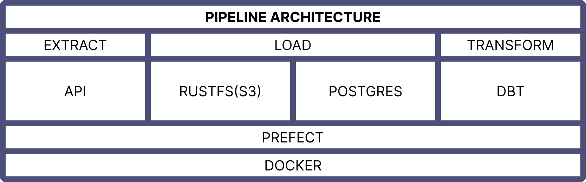
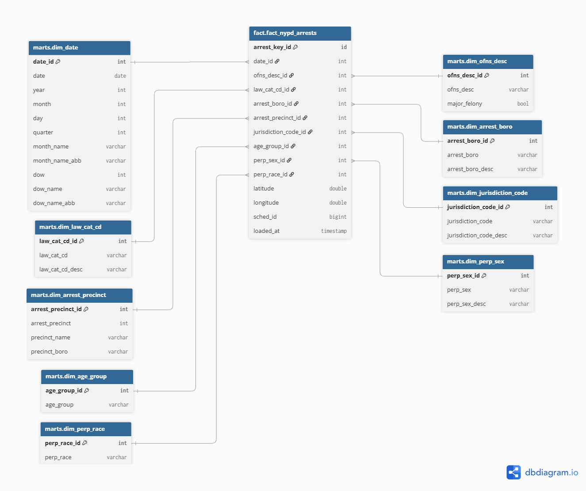
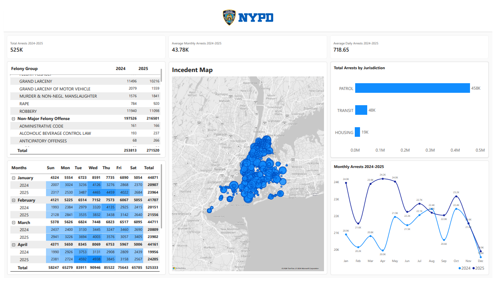

# **NYPD Arrests Data Pipeline**

## **Overview**

This data pipeline will extract raw arrests data from NYPD arrests API and perform necessary data transformations to produce a clean data that will be used for creating a reporting dashboard using PowerBI inspired from [NYPD'S CompStat dashboard](https://compstat.nypdonline.org/).

## **About the Data**

List of every arrest in NYC going back to 2006 through the end of the previous calendar year. This is a breakdown of every arrest effected in NYC by the NYPD going back to 2006 through the end of the previous calendar year. This data is manually extracted every quarter and reviewed by the Office of Management Analysis and Planning before being posted on the NYPD website. Each record represents an arrest effected in NYC by the NYPD and includes information about the type of crime, the location and time of enforcement.
In addition, information related to suspect demographics is also included.
This data can be used by the public to explore the nature of police enforcement activity.
Please refer to the attached data footnotes for additional information about this dataset.

Data source: https://data.cityofnewyork.us/Public-Safety/NYPD-Arrests-Data-Historic-/8h9b-rp9u/about_data.

## **Limitations of the Dataset**

Some of the columns does not have sufficient definition for data cleaning and standardization. Because of this, some columns aren't included during the api call.

The `ofns_desc`(offense description) column will be used to describe the arrest that occured.

## **Dataset Structure**

Only necessary columns for the project are included in this table.

| Column Name | Description | API Field Name | Data Type |
| --- | --- | --- | --- |
| **ARREST_KEY** | Randomly generated persistent ID for each arrest | arrest_key | Text |
| **ARREST_DATE** | Exact date of arrest for the reported event | arrest_date | Floating Timestamp |
| **OFNS_DESC** | Description of internal classification corresponding with KY code | ofns_desc | Text |
| **LAW_CAT_CD** | Level of offense: felony, misdemeanor, violation | law_cat_cd | Text |
| **ARREST_BORO** | Borough of arrest (B=Bronx, S=Staten Island, K=Brooklyn, M=Manhattan, Q=Queens) | arrest_boro | Text |
| **ARREST_PRECINCT** | Precinct where the arrest occurred | arrest_precinct | Number |
| **JURISDICTION_CODE** | Jurisdiction responsible for arrest (0=Patrol, 1=Transit, 2=Housing for NYPD; 3+ non-NYPD) | jurisdiction_code | Number |
| **AGE_GROUP** | Perpetrator’s age within a category | age_group | Text |
| **PERP_SEX** | Perpetrator’s sex description | perp_sex | Text |
| **PERP_RACE** | Perpetrator’s race description | perp_race | Text |
| **Latitude** | Latitude coordinate (WGS 1984, EPSG 4326) | latitude | Number |
| **Longitude** | Longitude coordinate (WGS 1984, EPSG 4326) | longitude | Number |

_ARREST_DATE column indicates a floating timestamp data type but the api only returns YYYY-MM-DD value._

## **Technology Stack**

| **Tool**          | **Purpose**                           |
|--                 |--                                     |
|*Prefect           | Orchestration                         |
|*Postgres          | Prefect database                      |
|*RustFS            | S3 compatible object storage          |
|Postgres           | Local data warehouse                  |
|DBT                | Data Transformation                   |
|Docker             | Containerization                      |

_Legend: (*) - Running in a docker container_

## **Architecture and Process Overview**
### Architecture

### **ELT Process Overview**

#### **Extract**
1. Raw arrest data will be extracted from the api by year and month.

#### **Load 1**
2. The raw data will be extracted in increments of 15000 records per API call and will be saved as a parquet file in an s3(rustfs) bucket. 
3. This process will repeat until all records have been extracted for that year and month.
4. Once all data for that year and month have been extracted, it will be merged into a single parquet file.

#### **Load 2**
3. The merged year and month file will be loaded in the raw landing table of the data warehouse(postgres).

#### **Transform**
4. DBT transformations will be executed once the raw data is successfully loaded.

_The process repeats until the criteria is met for executing the pause deployment schedule._

## **Fact and Dimension Tables ERD**

## **PowerBI Dashboard Sample**

- This dashboard is an attempt to replicate NYPD's [compstat](https://compstat.nypdonline.org/) dashboard.
- The PowerBI file is available under the powerbi directory.
